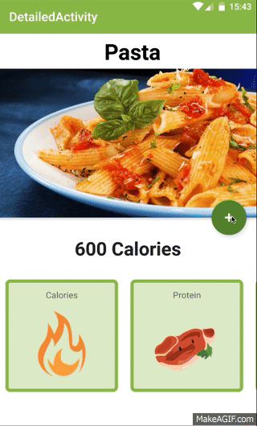
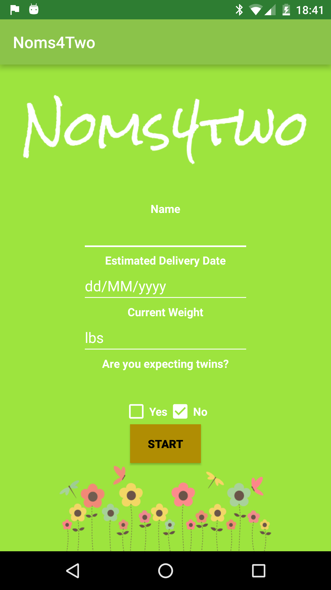
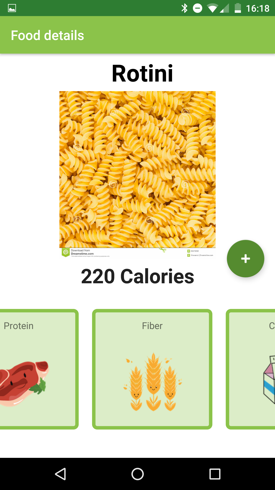
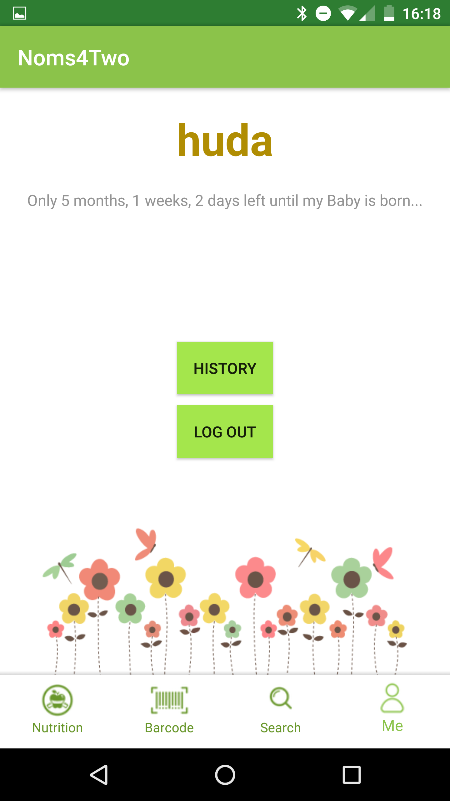
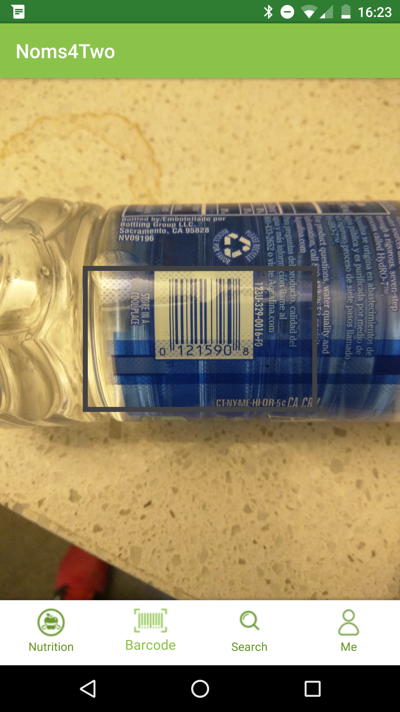

# Noms-4-two
### Group 28, UC Berkeley CS160 Spring 2016
_Note: This app is best viewed on a Nexus 6. Running API 23._

## Group Members

**Haojun Li, Pradeep Kalipatnapu, Huda Iftekhar, Huong Vu, Ki Ey Kouch.**

## Project Description
Eating during pregnancy is extremely stressful because pregnant moms are picky about 
what they can or can’t eat. Their dietary restrictions have different nutrient requirements
from their pre-pregnancy days. Even nutrition labels on nutritionFacts are made for
daily recommendations, but not for pregnant women. Our app will help solve this problem
by logging nutritionFacts intake, taking into account nutritionFacts restrictions and
preferences.

##Searching for Food Nutrition Info
Noms4Two has an incredible search function. Using FatSecret API has allowed Noms4Two to search all possible foods, including branch and generic type (Apple, Pizza with Pepperoni, etc). This creates an incredible flexibility and powerful option for searching all kind of food and obtain the accurate nutrition information. This API, FatSecret, allows up to 5000 search per day, and contains nutritionfact such as Calories, Protient, Fiber, Pottasium, Iron, Calcuim, and Vitamin C. Using 1-serving-size nutrition info give better and precise calculation. 

#### Challenges with FatSecret API
One of the most challenges of using FatSecret Rest API are Authentication with OAuth core 1.0 protocol. This API requires severals parameters, and two of them cause problem during the implementation period. The oauth_timestamp and oauth_signature were invalid for several time. 
* oauth_timestamp - The developer documents written by FatSecret requires oauth_timestamp need to be positive and always greater than the previouse request. Althought, the implementation was correct, FatSecret always rule out the current time. Solution, multiple current time by 2.
* oauth_signature - This oauth_signature needs to sign using oauth_signature method, HMAC-SHA1, along with all other parameters to generation oauth_signature. This means that every API call must be unique and dependent of all other variables, which mean all other varibales must be valid. Also, it is difficulty to debug the usage of this API since each URL can be use only one.

#### Challenges with Camera/Barcode:
The biggest challenge of barcode scanning is to open up and process the images to detect
barcode. Once we have the barcode in string format we simply send it to an external API.
We used both Google Vision Barcode API and Android Camera2 API just to scan the barcode.
Here are some specific challenges.
* The barcode API was built before Camera2 API release, which makes them incompatible.
* There was also a 20 call per day limit on the external API that translates barcode string to food detail, which make testing much harder as we cannot use the API frequently.

## Video Demo
The video is linked [here](https://www.youtube.com/watch?v=dmTKNkT9zWU)

## Screenshots

## Acknowledgements
* Circular animations are courtesy of an amazing stackoverflow answere [here](
http://stackoverflow.com/questions/29381474/how-to-draw-a-circle-with-animation-in-android)
* [FatSecret API](https://github.com/ranesr/fatsecret4j) and Java Library
* Barcode Scanning uses [Nutrionix API](https://www.nutritionix.com/)
